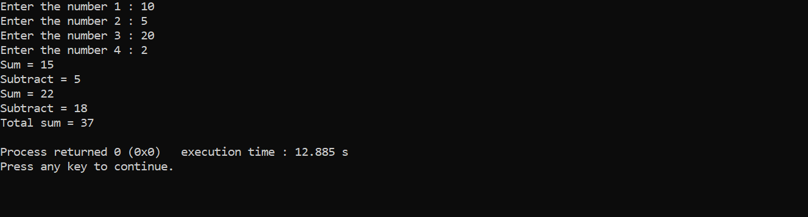
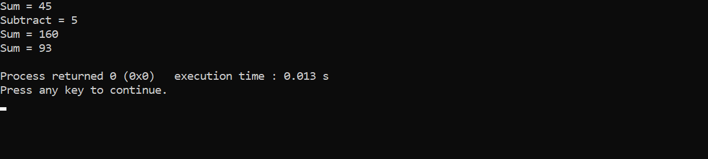
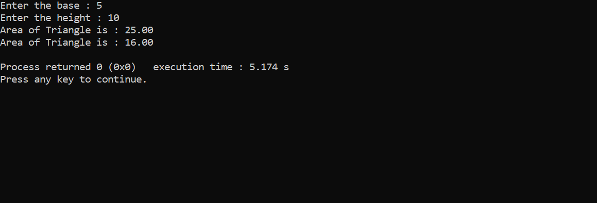
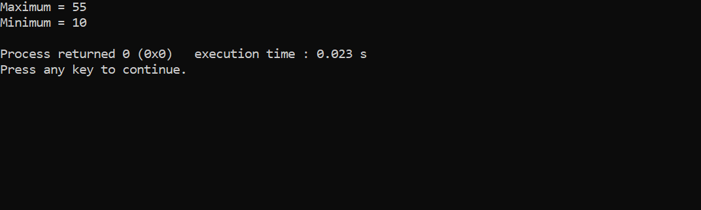
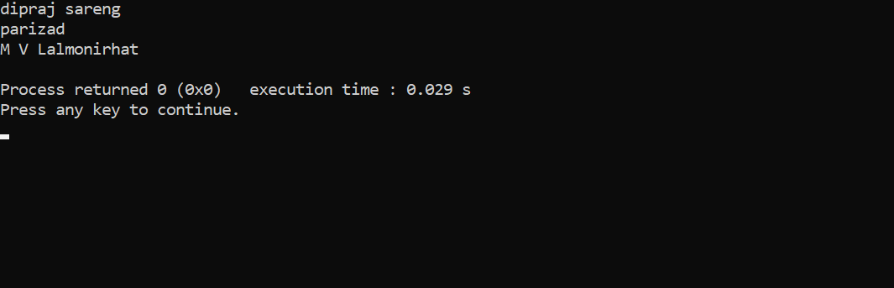
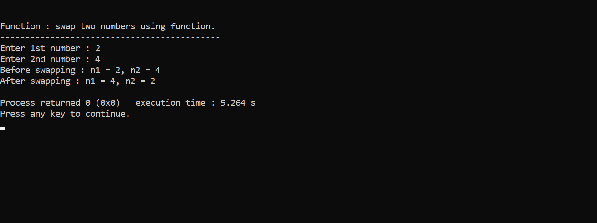

<!--function-->

__F__~~u~~_n_~~c~~`tion`

---

### sum of two three numbers using function
</br>

```c
#include<stdio.h>
int main()
{
    int num1,num2,num3,num4;
    printf("Enter number 1 : ");
    scanf("%d",&num1);
    printf("Enter number 2 : ");
    scanf("%d",&num2);
    printf("Enter number 3 : ");
    scanf("%d",&num3);
    printf("Enter number 4 : ");
    scanf("%d",&num4);

    printf("Sum = %d\n",sum(num1,num2));
    printf("Subtract = %d\n",sub(num1,num2));
    printf("Sum = %d\n",sum(num3,num4));
    printf("Subtract = %d\n",sub(num3,num4));
    printf("Total sum = %d\n",s(num1,num2,num3,num4));

}

int sum(int a,int b)
{
    return a+b;
}

int sub(int c,int d)
{
    return c-d;
}

int s(int a,int b,int c,int d)
{
    return a+b+c+d;
}
```  
another

```c
#include<stdio.h>
int sum(int a,int b)
{
    return a+b;
}

int sub(int c,int d)
{
    return c-d;
}

int s(int a,int b,int c,int d)
{
    return a+b+c+d;
}

int main()
{
    int num1,num2,num3,num4;

    printf("Enter the number 1 : ");
    scanf("%d",&num1);
    printf("Enter the number 2 : ");
    scanf("%d",&num2);
    printf("Enter the number 3 : ");
    scanf("%d",&num3);
    printf("Enter the number 4 : ");
    scanf("%d",&num4);

    printf("Sum = %d\n",sum(num1,num2));
    printf("Subtract = %d\n",sub(num1,num2));
    printf("Sum = %d\n",sum(num3,num4));
    printf("Subtract = %d\n",sub(num3,num4));
    printf("Total sum = %d\n",s(num1,num2,num3,num4));
}
```  
  

```c
#include<stdio.h>
int sum(int a,int b,int c)
{
    return a+b+c;
}
int sub(int a,int b,int c)
{
    return a-b-c;
}

int main()
{
    printf("Sum = %d\n",sum(4,5,6));
    printf("Sub = %d\n",sub(10,5,2));
}
```
<image src="./images/shorter.png" width="500" title="shor"/>  

```c
#include<stdio.h>
int sum(int a,int b)
{
    return a+b;
}
int sub(int a,int b)
{
    return a-b;
}

int main()
{
    int result = sum(20,15);
    int resultb = sub(30,3);
    printf("Sum = %d\n",result);
    printf("Subtract = %d\n",resultb);
}
```  
<image src="./images/alternative.png" width="500" title ="alternative"/>  

### void instead return

```c
#include<stdio.h>
void sum(int a,int b,int c)
{
    printf("Sum = %d\n",a+b+c);
}

void sub(int d,int a,int o)
{
    printf("Subtract = %d\n",d+a+o);
}

int main()
{
    sum(10,15,20);
    sub(20,10,5);
    sum(30,50,80);
    sum(90,1,2);
}
```

  

### Square ^

```c
#include<stdio.h>
int square(int a)
{
    return a*a;
}

int main()
{
    int num;
    printf("Enter the number : ");
    scanf("%d",&num);
    int result = square(num);
    printf("Square = %d\n",result);
    printf("Square = %d\n",square(2));
    printf("Square = %d\n",square(5));
}

```  
<image src="./images/square.png"/>

### Area of Triangle

```c
#include<stdio.h>
double at(double b, double h)
{
    return (b*h)/2;
}

int main()
{
    double base,height;
    printf("Enter the base : ");
    scanf("%lf",&base);
    printf("Enter the height : ");
    scanf("%lf",&height);
    double result=at(base,height);
    printf("Area of Triangle is : %.2lf\n",result);
    printf("Area of Triangle is : %.2lf\n",at(10,5));
}

``` 
<image src="./images/areaoftriangle.png" width="500" title="areaoftriangle"/>   
alternative

```c
#include<stdio.h>
void at(double b,double h)
{
    double result =  (b*h)/2;
    printf("Area of Triangle is : %.2lf\n",result);
}

int main()
{
    double base,height;
    printf("Enter the base : ");
    scanf("%.2f",&base);
    printf("Enter the height : ");
    scanf("%.2lf",&height);

    at(base,height);
    at(10,3.2);
}
 

### whole square unlimited

```c
#include<stdio.h>
void calculatepower(double a,double b)
{
    double i,result=1;
    for(i=1; i<=b; i++)
    {
        result=result*a;
    }
    printf("Result = %.2lf",result);
}

int main()
{
    double base,exp;
    printf("Enter the base : ");
    scanf("%lf",&base);
    printf("Enter the exponent : ");
    scanf("%lf",&exp);

    calculatepower(base,exp);
    calculatepower(10,2);
    calculatepower(3,3);
    calculatepower(4,2);
}
```  
<image src="./images/power.png" width="500" title="power"/>  

### array in function

```c
#include<stdio.h>
int main()
{
    int a[]={10,33,50,66,22};
    display(a);
}
void display(int x[])
{
    for(int i=0; i<5; i++)
    {
        printf("%d\n",x[i]);
    }
}
```  
<image src="./images/arrayfunction.png" width="500" title="arrayfunction"/>  

### maximum number using function

```c
#include<stdio.h>
int main()
{
    int a[]={10,30,50,33,44},b[]={30,44,13,55,23};
    maximum(a);
    maximum(b);
    minimum(a);
    minimum(b);


}

void maximum(int x[])
{
    int max=x[0];
    for(int i=1; i<5; i++)
    {
        if(x[i]>max)
        {
            max=x[i];
        }
    }
    printf("Maximum = %d\n",max);
}

void minimum(int y[])
{
    int min=y[0];
    if(int j=1; j<5; j++)
    {
        if(y[j]<min)
        {
            min=y[j];
        }
    }
    printf("Minimum = %d\n",min);
}
```
<image src="./images/maxmin.png" width="500" title="maxmin"/>  

### alternative

```c
#include<stdio.h>
int main()
{
    int a[]={10,30,55,42,25};
    maximum(a);
    minimum(a);
    printf("Maximum = %d\n",maximum(a));
    printf("Minimum = %d\n",minimum(a));
}
int maximum(int x[])
{
    int max=x[0];
    for(int i=1; i<5; i++)
    {
        if(x[i]>max)
        {
            max=x[i];
        }
    }
    return max;
}
int minimum(int y[])
{
    int min=y[0];
    for(int j=1; j<5; j++)
    {
        if(y[j]<min)
        {
            min=y[j];
        }
    }
    return min;
}
```
 
 
</br>  

### string function

```c
#include<stdio.h>
void display(char x[])
{
    char i;
    while(x[i]!='\0')
    {
        printf("%c\n",x[i]);
        i++;
    }
}

int main()
{
    char a[]="dipraj sareng";
    display(a);
}
```

<image src="./images/functionstring.png" width="500" title="functionstring"/>  

### similar

```c
#include<stdio.h>
void display(char x[])
{
    char i=0;
    while(x[i]!='\0')
    {
        printf("%c",x[i]);
        i++;
    }
    printf("\n");
}

int main()
{
    char a[]="dipraj sareng";
    char b[]="parizad ";
    char c[]="M V Lalmonirhat";
    display(a);
    display(b);
    display(c);
}
```  
</br>


</br>

### factorial using recurtion

```c
#include<stdio.h>
int main()
{
    int result=fact(5);
    printf("Factorial of 5 is : %d\n",result);
}
int fact(int x)
{
    if(x==1)
    {
        return 1;
    }
    else
    {
        return x*fact(x-1);
    }
}
```
<image src="./images/recursion.png" width="500" title="recursionfactorial"/>  
</br>

# practice

```c
// a programme that print power/square
#include<stdio.h>
int square(int ,int );
int main(void)
{
    int base,exponent;
    printf("Enter base : ");
    scanf("%d",&base);
    printf("Enter exponent : ");
    scanf("%d",&exponent);
    square(base,exponent);
    printf("The square of %d is : %d\n",base,square(base,exponent));
}
int square(x,y)
{
    int mult=1,i=1;
    while(i<=y)
    {
        mult=mult*x;
        i++;
    }
    return mult;
}
```
<image src="./images/pr1.png" width="500" title="powerorsquare"/>  

### swap two numbers using function

```c
#include<stdio.h>
void swap(int *,int *);
int main()
{
    int n1,n2;
    printf("\n\nFunction : swap two numbers using function. \n");
    printf("--------------------------------------------\n");
    printf("Enter 1st number : ");
    scanf("%d",&n1);
    printf("Enter 2nd number : ");
    scanf("%d",&n2);
    printf("Before swapping : n1 = %d, n2 = %d\n",n1,n2);
    swap(&n1,&n2);
    printf("After swapping : n1 = %d, n2 = %d\n",n1,n2);
    return 0;
}
void swap(int *x,int *y)
{
    int temp;
    temp = *x;
    *x=*y;
    *y=temp;
}
```


### check prime or not

```c
#include<stdio.h>
int main()
{
    while(1)
    {
        int num;
        printf("\n\n Function : check the number is prime or not using function\n");
        printf("---------------------------------------------------------------\n");
        printf("Enter the number : ");
        scanf("%d",&num);
        prime(num);
    }
}
void prime(int x)
{
    int count=0,i;
    if(x<=1)
    {
        printf("prime number\n");
    }
    for(i=2; i<x; i++)
    {
        if(x%i==0)
        {
            count++;
            break;
        }

    }
    if(count==0)
    {
        printf("The number %d is a prime number\n\n",x);
    }
    else
    {
        printf("The number %d is not a prime number\n\n",x);
    }
}
```
### alternative

```c
#include<stdio.h>
int primeornot(int);
int main()
{
    int num,result;
    printf("\n\n Function : Check prime or not using function\n");
    printf("-------------------------------------------------\n");
    printf("Enter positive number : ");
    scanf("%d",&num);
    result=primeornot(num);
    if(result==1)
    {
        printf("The number %d is a prime number\n\n",num);
    }
    else
    {
        printf("The number %d is not a prime number\n\n",num);
    }
}
int primeornot(int x)
{
    int i=2;
    while(i<x)
    {
        if(x%i==0)
        {
            return 0;
        }
        else
        i++;
    }
    return 1;
}
```
<image src="./images/primeornot" width="500" title="primeornot"/>

